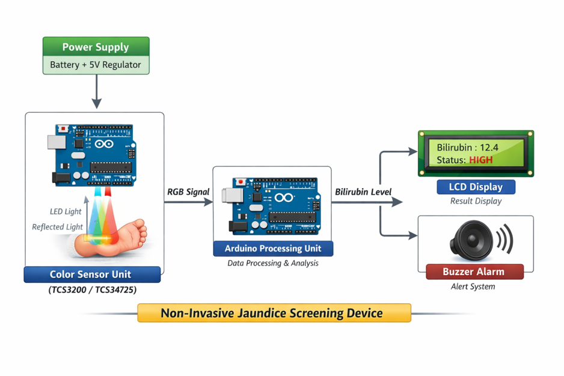

# Non-invasive Neonatal Bilirubin Estimation System

## Problem Statement
Neonatal jaundice is a common condition in newborns caused by elevated bilirubin levels. Traditional bilirubin measurement methods are invasive and may cause discomfort. This project aims to design a non-invasive system for estimating bilirubin levels using optical sensing and computational processing.

## System Overview
The system captures optical signals from neonatal skin using a sensor setup. The signals are processed using an Arduino-based system to estimate bilirubin levels.

## System Architecture

### Workflow
- Optical sensor captures reflected light from skin  
- Arduino processes raw sensor data  
- Signal is transmitted for analysis  
- Algorithm estimates bilirubin level  
- Final output is displayed  

### Diagram

## Technologies Used
- Arduino Uno (or equivalent microcontroller)
- Optical Sensor (Photodiode / Color Sensor)
- Embedded C / Arduino Programming
- Signal Processing via Microcontroller

## Repository Structure
- hardware/ → Arduino implementation code  
- src/ → Future data processing / analysis code  
- README.md → Project documentation  

## Output
The system generates estimated bilirubin levels based on optical sensor readings.

## Objective
To develop a low-cost, non-invasive screening system for early detection of neonatal jaundice.

## Author
Abitha Ganesan  
B.E. Biomedical Engineering Student  
GitHub: https://github.com/abithaganesan
