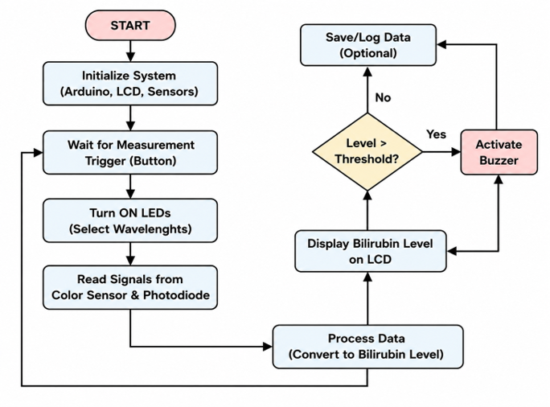
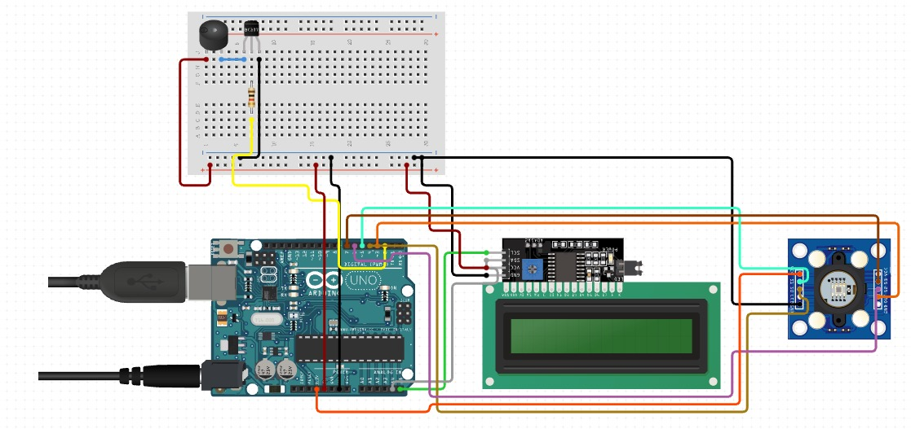
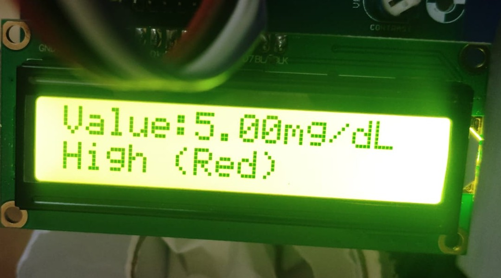

# Non-Invasive Neonatal Bilirubin Estimation System

## Project Overview
Neonatal jaundice is a common condition in newborns caused by elevated bilirubin levels. Traditional bilirubin testing methods are invasive and require blood samples.

This project presents a **portable optical reflectance device for rapid bilirubin estimation in infants**, using reflected light analysis to reduce discomfort and enable faster screening.

## Objective
To design a low-cost, non-invasive biomedical device for early detection of neonatal jaundice using optical reflectance and embedded processing.

## System Architecture

 *Figure 1: High-level system architecture showing optical sensing, microcontroller processing, and output display.*

## System Workflow

*Figure 2: Step-by-step working flow of the bilirubin estimation system.*

---

## Circuit Diagram

 *Figure 3: Hardware connections between Arduino Uno, optical sensor, LCD display, and buzzer system.*

## Output Result

 *Figure 4: System output displaying estimated bilirubin level based on sensor readings.*

## Technologies Used
- Arduino Uno / ESP32  
- Optical Sensor (Photodiode / RGB Sensor)  
- Embedded C (Arduino Programming)  
- Basic Signal Processing Techniques  
- LCD Display Module  

## Repository Structure

- **hardware/** → Arduino code and hardware implementation  
- **src/** → Future data processing modules  
- **system_architecture.png** → System design diagram  
- **Flow_chart.png** → System workflow  
- **circuit_diagram.jpeg** → Hardware wiring diagram  
- **bilirubin_output.jpeg** → Output result  
- **README.md** → Project documentation  

## Key Features
- Non-invasive bilirubin estimation  
- Real-time optical signal processing  
- Portable and low-cost biomedical prototype  
- Immediate visual output via LCD  
- Early neonatal jaundice screening support  

---

## Results
- Optical sensor successfully captures reflectance signals  
- Arduino processes real-time sensor data  
- System generates bilirubin estimation output  
- Buzzer activates for high-risk levels  
- Demonstrates working prototype of biomedical screening device  

---

## Future Recommendations
- Integration with machine learning models for improved accuracy  
- Wireless data transmission to mobile application  
- Cloud-based patient monitoring system for hospitals  
- Calibration using clinical datasets for medical-grade precision  
- Improved sensor accuracy for NICU-level deployment  

---

## Author
**Abitha Ganesan**  
B.E. Biomedical Engineering Student  
Interested in biomedical signal processing and non-invasive medical devices  

GitHub: https://github.com/abithaganesan  

---

## Note
This project is developed for academic and internship demonstration purposes and represents a prototype-level biomedical engineering system.
